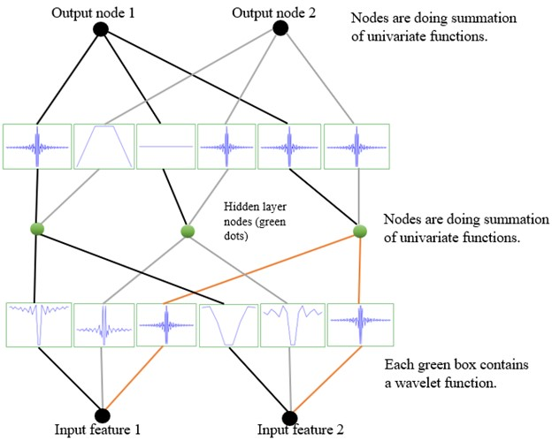

# KANs(Kolmogorov-Arnold Network)

## KANs的本质

一种新型的连接主义的算法框架，与MLP框架的区别在于，MLP的神经元拟合算法与KANs的节点拟合算法的本质不同；

## KANs的优缺点(相较于MLP)

优点：

- 模型参数少，节点少，参数存储压力小，可避免像MLP的无用参数过多的情况；
- KANs的重点在于激活函数上，激函数可使用已有的应用数学的诸多方程；而非像MLP一样只用纯数学，盲目堆参数量和训练数据的玄学炼丹；
- KANs借鉴于决策树的剪枝处理，通过正则化处理降低无用节点的幅值参数，再剪枝无用分支，实现了边训练边调整模型结构的操作；而非MLP训练前就固定的模型结构；
- 由于KANs的激活函数的灵活性，避免了MLP由一层固定一种激活函数所导致的梯度消失和需要大量数据集的问题；
- 用Kolmogorov-Arnold定理，增强了模型宽度对于模型效果的影响；

缺点：

- 放弃MLP以线性加权输入嵌入非线性激函数，选择KANs的非线性激函数嵌套非线性激函数，导致了模型算法公式的复杂度上升；(以时间复杂度换空间复杂度)
- KANs的拟合算法Kolmogorov-Arnold定理只有两层的公式，并未继续链式公式推导，导致KANs模型只能写两层；
- KANs的模型的反向传播机制的欠缺，仅仅靠剪枝去减去无用分支是不够的，放弃的加权输入处理,将导致隐藏层的损失项的计算是欠缺的；
- 对于浅层的激活函数的选择是可以的，但深度的激活函数选择则是一个问题；

## KANs的相关论文

链接: [https://pan.baidu.com/s/1TRDw4kBKxaMaHbnuJDImdA?pwd=iv79](https://pan.baidu.com/s/1TRDw4kBKxaMaHbnuJDImdA?pwd=iv79)

提取码: iv79

github的原始代码：[https://gitHub.com/Kindxiaoming/pykan](https://gitHub.com/Kindxiaoming/pykan)

## KANs的数学算法(Kolmogorov-Arnold Representation Theorem)：

$$
KANs(X)=\sum_{p=1}^{2n+1} F_p(\sum_{q=1}^{n} G_{p,q}(x_q))
$$

- 该公式的意思是一个关于多变量(n个元素)连续函数可以被2n+1个一元连续函数$F_p$和(2n+1)×n个一元连续函数$G_{p,q}$，拟合；(模型训练的目的就是拟合非线性函数)
- 2n+1的限制，放开后，即模型宽度的对于模型效果的提升，远比MLP模型的提升模型宽度对于模型效果提升不大的情况好得的多。
- $x_q$的单个节点的输入元素标量，X是$x_q$的元素集合；
- $G_{p,q}$是输入层节点的单输入单输出的激活函数，$F_p$是隐藏层节点的单输入单输出的激活函数；(现有的KANs只有这两层)
- KANs的激活函数远比MLP的选择更自由，可以选择应用数学的相关公式，但选择也是一个难点；
- G(x)函数的解释：$G(x) = w \cdot (b(x)+spline(x))$;
  - w是幅值参数,决定激活函数(例如spline(x))输出的比例；
  - b(x)是偏移函数，类似于残差网络的函数,例如$siLU(x)=\frac{x}{1+e^{-x}}$;
  - spline(x)叫样条函数，是用于拟合函数的。(每个节点区对应的一个样条函数又是由一元函数多项式组成的,三次效果不错，类似于泰勒公式。每个区间对应一个样条函数，按照区间拼接的样条函数组成了一个复杂的分段函数，也是多个样条函数拟合一个复杂函数的过程。(例如一幂次spline：$S_i(x)=a_0+a_1 \cdot (x-x_i) $；可知spline是存在权重a的可用来进行损失函数的反向传播)

## KANs的训练机制（边训练边调整模型结构）

1. 稀疏化节点：例如用正则化L1降低无用函数的幅值系数w;
2. 剪枝:去除w过小的节点分支；
3. 训练过程中手动设置激活函数；

## KANs的结构（现在只有两层）

- 从下往上输出，"Input feature 1"和"Input feature 2"都是一个输入对象的一个标量特征；
- "Input feature 1"经过了三个激活函数G(x)得三个输出值，"Input feature 2"也一样；
- 将"Input feature 1"和"Input feature 2"的输出值对应累加(此处是两两累加)；得到三个要输入到F(x)的标量特征；
- 得到三个要输入到F(x)的标量特征，输入两个激活函数F(x)得到6个输出数值；
- 再将按两个F(x)分类，累加得到两个输出特征“Output node 1”和“Output node 2”；
