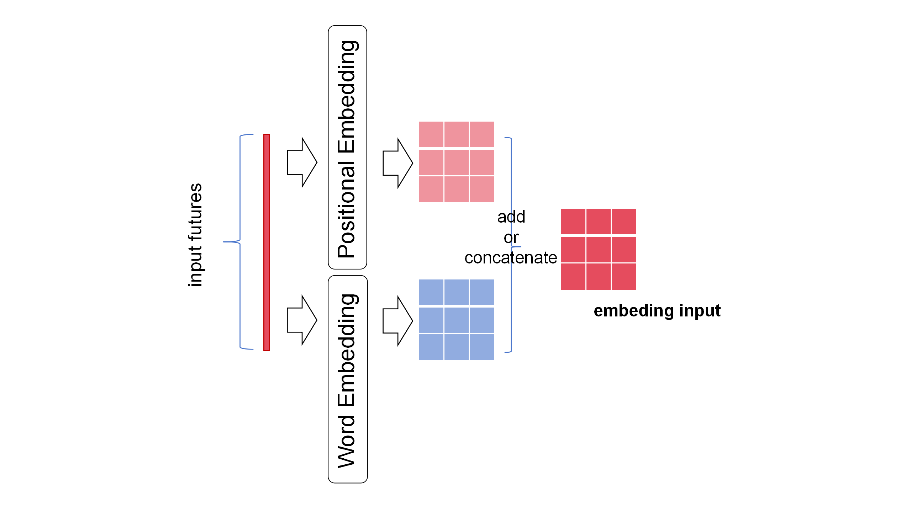
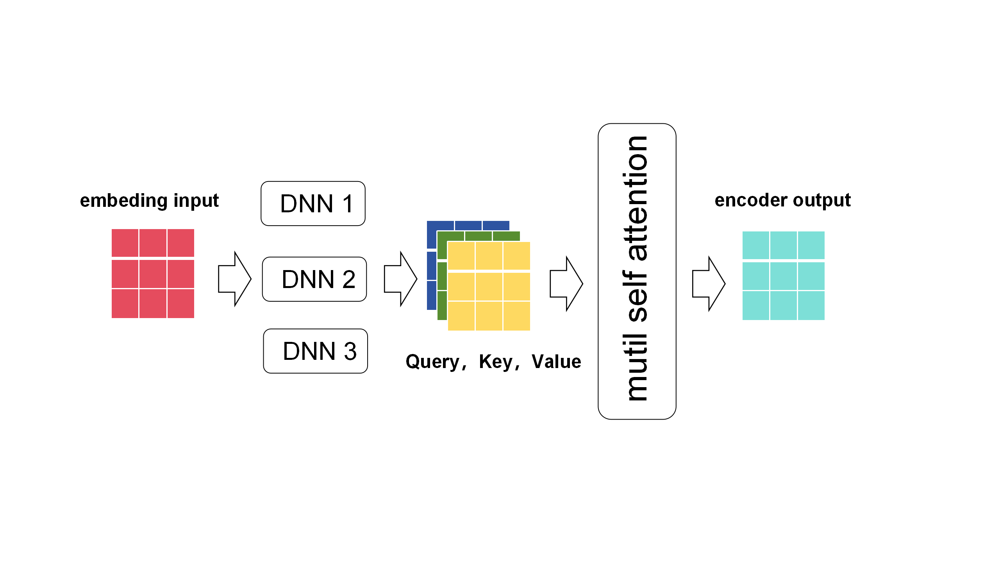
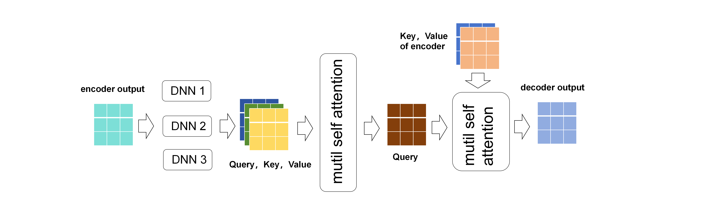

# Transformer

## 1. Transformer的本质

Transformer是本质是一个编码器-解码器框架Encoder-Decoder的夹心饼；
编码器与解码器之间，夹了多个并行的自注意力机制；

## 2. Transformer的应用场景和优缺点

### 应用场景

1. **自然语言处理（NLP）**：

   - 文本分类：如情感分析、主题分类等。
   - 文本生成：如机器翻译、文本摘要、对话生成等。
   - 问答系统：基于Transformer的模型可以处理复杂的问题和答案匹配。
   - 语言建模：预测给定文本序列中的下一个词或句子。
2. **语音识别（ASR）**：
   Transformer也被用于语音识别任务，通过处理音频的频谱图或梅尔频率倒谱系数（MFCC）等特征，将语音转换为文本。
3. **图像生成与处理**：

   - Transformer模型被用于处理图像，例如Vision Transformer（ViT）将Transformer应用于图像识别任务。
   - 图像生成和图像到文本的转换。
4. **时间序列分析**：
   Transformer可以处理时间序列数据，如金融预测、气候建模等。
5. **音乐生成与推荐**：

   - 利用Transformer模型生成音乐或进行音乐推荐。
6. **推荐系统**：

   - 结合用户历史行为和物品信息，Transformer可用于个性化推荐。

### 优点

1. **并行计算**：Transformer中的自注意力机制允许模型并行处理所有输入序列，从而提高了训练速度。
2. **长距离依赖**：Transformer能够捕获输入序列中的长距离依赖关系，这对于处理长文本或长序列数据非常重要。
3. **可解释性**：由于自注意力机制，Transformer可以提供一定程度的模型可解释性，例如通过注意力权重可视化来理解模型如何处理输入数据。
4. **灵活性**：Transformer模型可以很容易地扩展到其他任务和数据类型，只需稍作修改即可。

### 缺点

1. **计算成本高**：自注意力机制的计算复杂度与输入序列长度的平方成正比，这导致在处理长序列时计算成本很高。
2. **位置信息**：Transformer模型本身不包含位置信息，需要通过位置编码（如正弦/余弦位置编码）来弥补这一缺陷。
3. **模型大小**：基于Transformer的模型往往很大，需要大量的计算资源和存储空间来训练和部署。
4. **数据需求**：Transformer模型通常需要大量的标注数据来训练，这可能导致在某些数据稀缺的场景下效果不佳。
5. **稳定性**：由于Transformer模型的复杂性，它们在训练过程中可能表现出不稳定性，需要精心调整超参数和训练策略。

## 3. Transformer的相关代码

[Transformer的相关代码](./Transformer.ipynb)

## 4. Transformer的运算逻辑

Transformer的结构：输入数据 -> 词嵌入和位置嵌入 -> 编码器 -> 解码器 -> 全连接层的选择器；

### 词嵌入和位置嵌入

- Transformer的输入数据，与传统神经网络不同的的是，Transformer的训练对象只有一个长序列三维数据(其本质是一个超长的一维度向量)；
- 词嵌入(word embeding)和位置嵌入(positinal embeding),都是将一维向量变为二维的嵌入矩阵；
  - 词嵌入(word embeding)是按一段文字的每个单词种类，对单个单词进行扩展嵌入向量的；多个单词的嵌入向量就拼接为矩阵了；
  - 位置嵌入(positinal embeding)是按一段文字的每个单词的位置，对单个单词进行扩展嵌入向量的；多个单词的嵌入向量就拼接为矩阵了；
- 词嵌入(word embeding)和位置嵌入(positinal embeding)会产生两个矩阵，一般是将两个矩阵直接相加得一个嵌入最后的矩阵，但偶尔也会选择拼接操作；

### 编码器

- 嵌入最后的矩阵(embeding input)经过三个并行的DNN输出查询值矩阵(Query),键值矩阵(Key),值矩阵(Value);
- 查询值矩阵(Query),键值矩阵(Key),值矩阵(Value)进入多个注意力机制输出一个输出矩阵；

### 解码器

- 解码器与编码器的区别在于第二个多头注意力机制；
- 解码器的第二个多头注意力机制，所用的查询值矩阵(Query)是解码器的第一个多头注意力机制的输出，所用的Value，Key是编码器的embeding input的键值矩阵(Key),值矩阵(Value）；
### 多头注意力机制(计算对象全是矩阵)
- Q是查询值矩阵，K是键值矩阵,V是值矩阵;(i的下标表示是那个头，每个头都是并行且独立的,其每个头使用$Q_i,K_i,V_I都是三个大的Q，K，V的子矩阵)
- $head_i = Softmax(\frac{Q_i \cdot K_i^T}{\sqrt{d_i}}) \cdot V_i$;($d_i$是$K_i,Q_i,V_i$的维度(三者维度相同),其实$d_i=d/h$,d是单个大Q,K,V的总维度，h是头数；$head_i$是第i头的输出矩阵)
- $MultiHead(Q,K,V)=(Concat_{i=0}^h head_i) \cdot W_m$;(这个公式的意思是将多头的输出矩阵拼接后在，乘以权重矩阵得多头注意力机制的输出矩阵)
- 其实在MultiHead(Q,K,V)后，为了避免梯度消失，加入了一个前向网络(无反馈的DNN)并配置残差机制，再输出；

## 5. 交叉注意力机制(Cross attention机制);
- Cross attention是多头注意力机制的变体；
- Cross attention的算法依然是如下两个；
  - $head_i = Softmax(\frac{Q_i \cdot K_i^T}{\sqrt{d_i}}) \cdot V_i$;
  - $MultiHead(Q,K,V)=(Concat_{i=0}^h head_i) \cdot W_m$;
- Cross attention与一般多头注意力机制的不同在于Q,K,V的来源上：
  - 对于有监督学习而已，一般会有原始序列X，与目标序列y;
  - 在一般多头注意力机制中，K,Q,V都来源与原始序列X；
  - 但在Cross attention中，K,V依然来源于原始序列X，但Q来源于目标序列y，且y得到Q的方式与X得到K,V的方式一样；