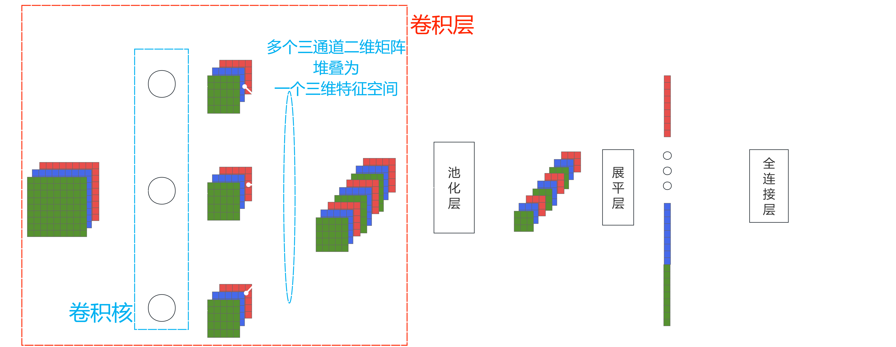

# CNN(卷积神经网络)

## 1. VGG16的本质

一个有13个卷积层和3个全连接层且滑动窗口大小都为(3,3)的卷积神经网络，
使用3个3x3的卷积核，这样做可以在保证感受野大小不变的同时，减少参数数量，提高计算效率。

## 2. CNN的应用场景和优缺点

### 应用场景

CNN在计算机视觉领域具有广泛的应用，主要包括以下几个方面：

- 图像分类：CNN能够处理大量的图像数据，通过学习图像的特征，将图像分为不同的类别。例如，在ImageNet数据集上，CNN可以实现对1000个不同类别的准确分类。
- 目标检测：CNN可以识别并定位输入图像中存在的多个目标。通过在卷积网络之后加入额外的回归和分类层，可以实现对目标位置和类别进行同时预测。
- 人脸识别：CNN在人脸识别领域也取得了显著的效果，能够准确识别出图像中的人脸，并进行身份验证。
- 语义分割：CNN可以将图像分割成多个区域，并为每个区域分配一个类别标签，实现像素级别的分类。
- 图像生成：CNN也可以用于图像生成任务，如通过生成对抗网络（GAN）等技术生成逼真的图像。

## 优点

CNN的优点主要体现在以下几个方面：

- 局部感知性：CNN通过使用卷积核进行局部感知，能够更好地捕捉图像中的局部特征。这种局部感知性使得CNN在处理图像时能够有效地提取细节信息，并具备良好的空间不变性。
- 参数共享：在CNN中，卷积核的参数被共享，这意味着同一个卷积核可以在整个输入图像的不同位置上进行特征提取。这种参数共享减少了网络的参数量，降低了过拟合的风险，并且使得模型更具有泛化能力。
- 池化操作：CNN通过池化操作可以减小特征图的尺寸，减少计算量，并保留主要的特征信息。这有助于提高模型的效率和鲁棒性。
- 空间层次结构：CNN采用多层卷积和池化操作，从低级到高级逐渐提取图像中的抽象特征。这种空间层次结构使得CNN能够处理不同层次的特征，并捕捉到图像中不同尺度上的信息。
- 并行计算：由于CNN中卷积和池化操作可以并行计算，因此在GPU等硬件加速器上具备良好的高效能。
  缺点
  CNN的缺点主要包括以下几个方面：
- 计算复杂性：由于CNN的层数较多，参数量较大，导致模型的计算复杂性较高。这对于训练和推理过程都会增加一定的时间和资源消耗。
- 数据需求：CNN对于大规模、多样化的训练数据的需求较高。如果训练数据集较小或不平衡，可能会导致过拟合或模型泛化能力不足。
- 生物学基础支持不足：CNN的生物学基础支持相对较弱，没有明确的记忆功能。虽然它能够处理图像数据，但在处理需要记忆和序列信息的任务时可能表现不佳。
- 特征理解不足：虽然CNN在特征检测方面表现出色，但在特征理解方面相对较弱。它可能难以解释和理解提取到的特征的具体含义和重要性。

## 3. CNN的相关代码

[VGG的相关代码](./VGG16.ipynb)

## 4. CNN的运算逻辑

- 卷积层的操作：
  - 输入对象为三通道图片，有三层原始特征图；
  - 每个卷积核的输入都一个多层特征图，但每一个特征图与卷积核之间都是单独运算的；
  - 一个卷积核有一个权重矩阵窗口，按照一定步长，扫描完一个特征图；
  - 扫描的过程是局部特征图与权重矩阵的点乘(两矩阵相同位置元素相乘)得到一个矩阵，再将这个矩阵的所以元素相加输出为一个标量；(将扫描得到的多个标量组合为输出矩阵)
  - 多个卷积核输出的多个特征矩阵，用堆叠的方式组成一个三维特征空间；
- 池化层的操作：
  - 三维特征空间进入池化层，也是一个一个特征图池化运算；
  - 池化运算：一个池化窗口，按照一定步长，池化扫描完一个特征图；(池化扫描分为平均池化(取局部矩阵中平均值作为标量输出)和最大池化(取局部矩阵中最大值作为标量输出))
  - 将池化运算的多个标量输出，组成了一个简化的特征图；(再将多个简化特征图的堆叠为一个简化的特征空间)
- 展平层的操作：
  - 三维特征空间进入展平层，也是一个一个特征图展平；
  - 对于一个特征图的展平是将二维矩阵，按行或列将二维矩阵分解为多个一维向量；
  - 将所有特征图生成的一维向量拼接一个更大的一维向量；
- 全连接层就原本DNN的操作，只不过是作为分类器而已；
