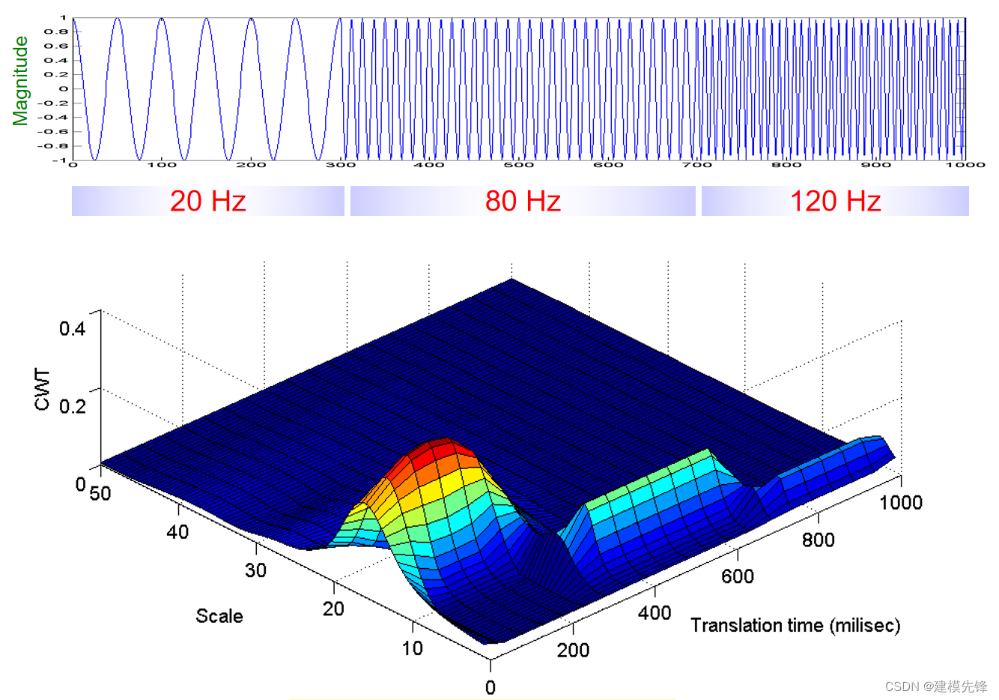

# 连续小波变换(CWT)

## 1. CWT的应用场景及优劣势

### 应用场景：

当一维信号具有**非平稳特性**时。**它能够根据信号的频率特性自动调整时间分辨率**，从而在不同频率范围内提供更好的分析结果

### 优势

1. **多分辨率分析**：CWT能够提供信号在不同频率下的信息，实现多分辨率分析。这使得它能够同时捕捉到信号的全局和局部特征。
2. **时频局部化**：CWT能够在时间和频率上同时实现局部化分析，这使得它能够精确地捕捉到信号的时变特性。
3. **数据压缩**：由于CWT能够将信号分解为不同频率的成分，因此可以利用这一特性进行数据压缩，减少存储和传输的数据量。
4. **去噪和信号恢复**：CWT在信号去噪和恢复方面也有很好的应用，能够有效地提取出信号中的有用成分，抑制噪声。

### 劣势

1. **计算复杂度**：相比于傅里叶变换等传统算法，CWT的计算复杂度较高，需要更多的计算资源。这可能会限制其在一些实时性要求较高的应用中的使用。
2. **小波基选择**：CWT的效果与小波基的选择密切相关，不同的小波基可能适用于不同的信号类型。因此，在实际应用中，需要根据信号的特点选择合适的小波基。
3. **边界处理**：在进行CWT时，需要对信号的边界进行处理。不同的边界处理方法可能会影响到变换的结果。这可能需要额外的注意和处理。

综上所述，连续小波变换在多个领域都有广泛的应用，并且具有多分辨率分析、时频局部化、数据压缩和去噪等优点。然而，它也存在计算复杂度较高、小波基选择和边界处理等劣势。在实际应用中，需要根据具体的需求和场景来权衡这些优缺点，选择最合适的算法来处理信号。

## 2. CWT的相关代码：

[CWT的相关代码](./CWT.ipynb)

## 3. CWT的数学公式

$$
CWT(a, b) = \frac{1}{\sqrt{a}} \int_{-\infty}^{\infty} x(t) \overline{\psi\left(\frac{t - b}{a}\right)} \, dt
$$

- CWT(a,b)是小波系数是标量，由尺寸系数a和平移系数b两个同时决定；（代表能量大小)
- 尺寸系数a是不同种类频率的具体值；("不同种类频率"是指单个长序列对象包含的多种短序列对象代表的频率)
- 平移系数b是指模拟信号每次采样的间隔时间；（由于传感器采样是离散，而非连续，所以要按一个点一个点的计算）
- x(t)是输入的一维序列向量，也是待分析序列；
- $\psi\left(\frac{t - b}{a}\right)$是小波函数，也叫基函数；

## 4. CWT产生的时频图解释

- 上图为幅值时间图，横轴为时间(刻度为时间点的个数)，纵轴为幅值大小，两者一一对应；(图中的长序列包含了3种短序列频率,20Hz,80Hz,120Hz)
- 下图为幅值时间图对应的时频图:
  - 横轴为时间(刻度为时间点的个数，也是采样间隔时间b的个数,即平移系数b的个数)；(也可转换为真实时间为s)
  - 纵轴为频率大小(表示一个采样间隔时间包含不同频率种类)；(一个采样间隔时间对应多种频率值a，即(一个采样间隔时间b对应多种尺寸系数a)
  - 竖轴为能量大小，用的小波系数CWT；

## 5. 参数介绍和选择策略

### 尺度长度

在连续小波变换（CWT）中，尺度参数是一个关键的选择，因为它决定了小波函数的宽度，从而影响了频率分辨率。尺度与频率成反比，尺度反映了分析的频率范围，尺度越小，小波函数衰减越快，频率越高；尺度越大，小波函数衰减越慢，频率越低。

$$
 信号频率= \frac{小波中心频率}{尺寸*采样周期}
$$

选择小波尺度的一般原则是：

- 高频特征： 如果关注信号的高频特征，应该选择较小的尺度；

- 低频特征： 如果关注信号的低频特征，应该选择较大的尺度；

- 覆盖感兴趣的频率范围： 尺度参数的选择应该使小波函数能够覆盖感兴趣的频率范围；如果期望信号有很高的频率变化，可能需要选择较小的尺度；

- 频率分辨率： 较小的尺度提供更好的频率分辨率，因为小波函数较窄，可以更精细地定位频率；但是，这也意味着在时间上的分辨率较差，因此，需要权衡时间分辨率和频率分辨率；

- 信号持续时间： 尺度参数的选择还应考虑信号的持续时间，如果信号是短暂的，可能需要较小的尺度；
- 尺度间隔： 在尺度参数上选择合适的间隔，以确保在整个频率范围内进行了适当的采样；这取决于具体的应用和信号特性。

### 小波函数

小波函数（wavelet）的选择也连续小波变换中的一个重要参数，它决定了小波基函数的形状，不同的小波函数适用于不同类型的信号和应用。

介绍常用的小波基函数：

- 'morl' ：Morlet小波是一种复杂的小波函数，它在频率域和时域都有较好的局部化性质；Morlet小波通常用于处理时频局部化要求较高的信号，比如处理振动信号或某些生物医学信号；

- 'cmor': Complex Morlet wavelet，复数 Morlet 小波，是 Morlet 小波的一个变种；

- 'cgau' ：Complex Gaussian wavelet，复数高斯小波，用于近似高斯信号；

- 'db1'：Daubechies小波是离散小波变换（Discrete Wavelet Transform, DWT）中常用的小波函数。Daubechies小波是紧支撑的小波，适用于处理有限长度的信号。

- 'haar'：Haar小波是最简单的小波函数之一，适用于对信号进行基本的低通和高通分解；

- 'mexh'：Mexican Hat小波，也称为Ricker小波，适用于处理具有尖峰或波包特性的信号；

- 'bior1.1'：Bior小波是一类双正交小波，其特点是具有对称和非对称两组滤波器，尤其适用于一些信号的多分辨率分析，如图像处理；

- 'sym2'：Symlet小波（Symmetric Wavelets），是一类对称的小波函数，它在某些方面类似于Daubechies小波，但是Symlet小波在设计上更加灵活。Symlet小波也是一种紧支撑小波，适用于有限长度的信号处理。
