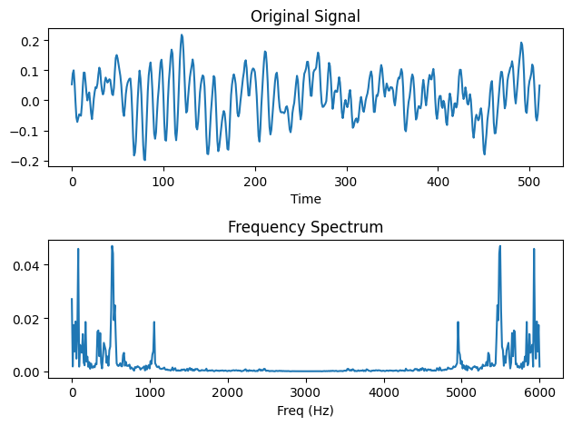

# 快速傅里叶变换(FFT)

## 1. FFT的本质；

通过离散傅里叶公式，将按一个有时序排序的一维幅值向量，变为一个按频率种类排序的一维频率分量向量；

## 2. FFT的应用场景及优劣势

### 应用场景

- 频谱分析：在信号处理中，FFT用于将时域信号转换为频域信号，从而清晰地观察到信号的频谱特征，如频率、幅度、相位等。这对于理解信号的特性、检测频谱中的峰值或异常、滤波等具有重要意义。
- 图像处理：FFT在图像处理中用于图像的频谱分析、滤波和增强。通过将图像转换到频域，可以观察到图像中存在的频率特征，从而进行频域滤波来去除图像中的噪声或者进行图像增强。此外，FFT还可以用于图像压缩，通过去除一些高频和低频成分来减少冗余数据。
- 音频处理：FFT在音频处理中用于音频压缩和音乐合成。通过将音频从时域转化为频域，可以对频域信息进行压缩，去除一些高频和低频成分，从而减少冗余数据。在音乐合成中，FFT可以将多个声音信号从时域转化为频域，在频域中进行加和操作，避免在时域中信号相加时出现相位问题。
- 通信领域：在无线电通信中，FFT被广泛应用于OFDM（正交分组多路复用）调制技术中，通过FFT技术将高速数据流分割成多个低速子载波，在每个子载波上进行调制和解调，从而提高无线电信号的传输速率和抗干扰能力。在有线通信中，FFT也被广泛应用于数字信号处理中，如在数字电视中分离视频和音频数据。

### 优势

- 高效性：FFT可以在O(nlogn)的时间复杂度下进行，远远快于暴力算法(O(n^2))，适用于大规模数据处理。
- 精度高：FFT可以处理大量数据，同时保持足够高的精度。
- 易于实现：FFT的算法比较容易理解和实现，可以通过多种语言和软件包进行使用。
- 可靠性：FFT算法已经历了数十年的实践和应用，被广泛认可为一种可靠、高效的算法。
- 适用性广：FFT可以处理各种类型的信号，包括周期和非周期信号，还可以处理多通道的数据。

### 劣势

- 精度问题：FFT算法在计算过程中可能会出现精度问题，因为需要对浮点数进行离散化处理，可能导致精度损失。
- 实现复杂度高：FFT算法的实现复杂度较高，需要一定的数学基础和编程技能。
- 数据长度限制：FFT算法的计算速度和精度都与数据长度有关。当数据长度过大时，FFT算法的计算速度会变慢，精度也会受到影响。

## 3. FFT的相关代码：

[FFT的相关代码](./FFT.ipynb)

## 4. FFT的数学公式

FFT是离散傅里叶函数的嵌套；

### 离散傅里叶公式和连续傅里叶公式；

连续傅里叶(FT)公式:

$$
FT(f)= \int_{-\infty}^{\infty} x(t) \cdot e^{−i \cdot 2π \cdot f \cdot t} dt
$$

- x(t)是时间点t对应的幅值；
- f是频率；
- $e^{−i \cdot 2π \cdot f \cdot t}$是复数项；

离散傅里叶(DFT)公式:

$$
DFT(k)=\sum_{i=0}^{N-1} x[i] \cdot e^{−i \cdot 2π \cdot k \cdot \frac{i}{N}}
$$

- k是两个相邻时间点的时间间隔所对应的频率的索引；
- N代表的时间点的个数，也是序列的长度；
- x[i]时间点i对应的幅值；
- $e^{−i \cdot 2π \cdot k \cdot \frac{i}{N}}$是复数项；

### FFT的运算逻辑

1. 将一个时间序列a分解为奇数索引对应的时间序列x和偶数索引对应的时间序列y;
2. 分别用离散傅里叶函数计算x和y得到两个DFT序列；
3. 再将两个DFT序列按相同索引相加得最终的DFT序列；

## 5. CWT产生的时频图解释

- 上图为时域图：
    - 横轴是时间点；
    - 竖轴是幅值；
- 下图是用FFT转换后的频域图：
    - 横轴是频率；
    - 竖轴是FFT的输出值；

