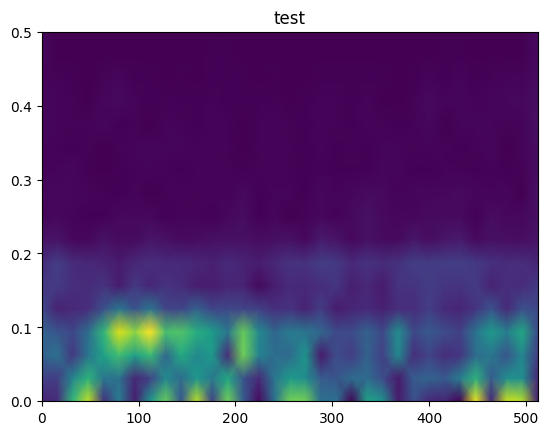

# 短时傅里叶变换(STFT)

傅里叶变换的本质：将一个复杂波形分解为多个正弦波的叠加，但会损失时间信息；

## 1. STFT的应用场景及优劣势

STFT（短时傅里叶变换）是一种用于分析非平稳信号（即其统计特性随时间变化的信号）的时频分析方法。STFT使用**固定长度的窗口对信号进行分段**，这可能导致在处理频率变化较快的信号时，时间分辨率和频率分辨率之间的权衡不够理想。

1. **语音信号处理**：在语音识别、语音合成、语音增强等领域中，STFT被广泛用于提取语音信号的频谱特征，如MFCC（Mel频率倒谱系数）等。
2. **音乐信号处理**：STFT可用于音乐信号的频谱分析、音高检测、乐器识别等任务。
3. **生物医学信号处理**：在心电图（ECG）分析、脑电图（EEG）分析、生物医学图像处理等领域，STFT可以帮助提取和分析生物信号中的频率成分和时变特性。
4. **机械振动分析**：对于机械设备的振动信号，STFT可以用于检测故障、分析振动特性以及进行故障诊断。
5. **雷达和声纳信号处理**：在雷达和声纳系统中，STFT可以帮助分析目标回波信号的频率和时变特性，从而实现对目标的检测和跟踪。

### 优势

1. **时频局部化**：STFT可以在一段时间内对信号进行局部频谱分析，因此能够捕捉到非平稳信号中的时变特性。
2. **高分辨率**：通过选择合适的窗口大小和重叠比例，STFT可以实现较高的时间分辨率和频率分辨率。
3. **灵活性**：STFT的窗口大小和重叠比例可以根据具体应用场景进行调整，以适应不同的信号特性。
4. **计算效率**：相对于其他时频分析方法（如Wigner-Ville分布等），STFT的计算复杂度较低，更易于实现和应用。

### 劣势

1. **固定窗口**：STFT使用固定长度的窗口对信号进行分段，这可能导致在处理频率变化较快的信号时，时间分辨率和频率分辨率之间的权衡不够理想。
2. **无法同时达到最佳时频分辨率**：由于Heisenberg不确定性原理的限制，STFT无法同时实现最佳的时间分辨率和频率分辨率。在某些应用场景中，可能需要使用其他更高级的时频分析方法（如小波变换、Wigner-Ville分布等）来获得更好的性能。
3. **对噪声敏感**：STFT对噪声较为敏感，特别是在低频区域。因此，在噪声环境下进行STFT分析时，可能需要进行预处理或采用其他方法来降低噪声的影响。
4. **不适合处理非线性信号**：STFT主要基于线性变换的思想，对于非线性信号的处理能力有限。在处理具有非线性特性的信号时，可能需要采用其他非线性时频分析方法（如Hilbert-Huang变换等）。

## 2. STFT的相关代码：

[STFT的相关代码](./STFT.ipynb)

## 3. STFT的数学公式

$$
STFT(t,f)=\int x(t) \cdot w(T-t) \cdot e^{−j2πfτ} dT
$$

- STFT(t,f)是短时傅里叶函数的输出是标量，由时间点t和频率成分f两个同时决定，以一个短序列为计算对象;（代表能量大小)
- x(t)是输入的一维序列向量，也是待分析序列;
- w(T-t)是窗口函数，将一个长序列进行分割为多个短序列，再将短序列带STFT(t,f)进行运算;(用窗口函数的固定长度，将一个长序列分割为多个短序列，允许两个短序列之间重复率，保证序列的连续信息)
- $e^{−j2πfτ}$是傅里叶函数自带的复指数项;

## 4. STFT产生的时频图解释

- 横轴为时间(刻度为时间点的个数，不过是经过傅里叶窗口的固定长度筛选过的)；(也可转换为真实时间为s)
- 纵轴为频率成分FFT bin的索引;(在频域中，信号被傅里叶函数分解为一系列的正弦波（或复指数波）的叠加，每个正弦波都有一个特定的频率、幅度和相位，所以可以用索引定位)
- 颜色深浅为能量大小，用的STFT(t，f)的输出值,由时间点和频率成分f两要数确定；

## 5. 参数介绍和选择策略

nperseg（窗口长度）：

- nperseg 定义了每个时间段内的信号长度，也就是说，它规定了窗口的大小。
- 较小的 nperseg 可以提供更高的时间分辨率，因为窗口更短，可以捕捉到信号的更快变化。但频率分辨率较差。
- 较大的 nperseg 提供更高的频率分辨率，但可能失去对信号快速变化的捕捉。
- 选择适当的窗口长度要根据信号特性，如频率变化的速率和信号长度等。

noverlap（重叠长度）：

- noverlap 定义了相邻时间段之间的重叠部分。
- 较大的 noverlap 可以提高时间分辨率，因为相邻时间段之间有更多的共享信息。但可能导致频谱图中的泄漏（leakage）。
- 较小的 noverlap 可以提高频率分辨率，减少泄漏，但时间分辨率可能下降。

选择策略：

- 参数的选择需要考虑到对信号分析的具体需求，平衡时间和频率分辨率，尝试不同的 nperseg 和 noverlap 值，观察结果的变化。
- 对于 nperseg，选择较小的值可能需要根据信号的特定频率内容进行调整。确保窗口足够短，以捕捉到频率变化。
- 对于 noverlap，通常选择 50% 的重叠是一个常见的起点
